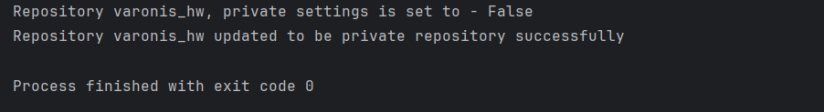
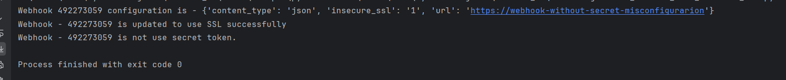

# varonis_hw

1. Miss configuration - Public repo
    
    * Explanation
      * Public repository can be accessed by anyone with GitHub account, any user can read the source code.
        In organizations this risk is higher because attackers can easily search more vulnerabilities in the code, like search for secrets in the code or packages that are not updated and contains CVE.
        In addition, competitors can copy the features in the code.
    * Steps to fix the misconfiguration
      * By using PyGitHub you can change the repo private settings from False (Public repo) to True (Private repo) using repo.edit(private=True)
    * The best practice to avoid such misconfiguration is by using organization policy that prevents from repositories to be public.
    * Changing the repository from public to private, can affect all the users/projects that use the repository. After changing the repository to private users without proper permissions to the project won't be able to access the project.
    * To relevant file for this misconfiguration is - 
      * misconfiguration_public_repo.py
      * To be able to run this script you need to create twi environment variables:
        * REPO_NAME - repository full id, example - "galborabia/varonis_hw"
        * GITHUB_TOKEN - token with permissions to the relevant repo (including write permissions of webhooks)

* screenshot

    

2. Miss configurations - insecure webhook

    * Explanation
      * Insecure SSL is high security vulnerability that exposes the user to Man in the middle attack.
      * Webhook without secrets, allows to anyone that gets the webhook URL to send requests to the server without the server being able to verify that the request is form a trusted source.
    * On the code I choose to fix only the insecure ssl, because adding a secret to the webhook without configure the server to verify the secret won't change anything. 
    
    * To relevant file for this misconfiguration is - 
        * misconfiguration_webhook_with_insecure_ssl.py
     * To be able to run this script you need to create twi environment variables:
        * REPO_NAME - repository full id, example - "galborabia/varonis_hw"
        * GITHUB_TOKEN - token with permissions to the relevant repo (including write permissions of webhooks)

    * screenshot 
   
        
# Framework design
   
   * Each IasS, PasS, SaaS that is supported by our framework will be separate service.
     * Each service will have multiple misconfigurations rules.
       * Each rule will be able to detect misconfigurations and fix misconfigurations. This helps us to keep the logic inside the rules.

   * Each IaaS service will have access to services with type PaaS/SaaS.
       * The idea is that the rules logic for SaaS/PaaS service will be in the same project, this will be easier to maintenance. When we need to add rule, we make the changes in one place and not in each IaaS service.
       * On these services we will create a route for each infrastructure (and also regular route) that helps the IaaS service to query specific rules.

   * Service API
     * run_analysis(analysis_request) 
       * This function will get everything is needed toto run analysis.
       Like create AWS instance that we can use to check configurations and fix them. 
       The request will have also detailed about the organization, that will help us to send Notification to the organization.
       
     * create_configuration_report
       * A configuration report contains a summary of all the detections.
       * The configuration report will bw send to organizations admins using the Notification service.

     * create_instance(credentials)
       * This function will create an instance that we can use to check and modify the configurations
       * Like GitHub object from PyGitHub.
    
     * In my code it's look that all the services are on the same project, by the real framework we will create project for:
       * GateWay Service - will have APIS to communicate with other service, database service, notification_service.
       * DataBase Service 
       * Notification Service 
       * Credentials Service 

   * Rule API
     * detect_misconfiguration(self, instance, *args, **kwargs) -> dict
       * analyze the instance configurations and return dict with all the detections.
     * fix_misconfiguration(self,  instance, report, *args, **kwargs)
         * fix misconfigurations that was detected in detect_misconfiguration function.
         * modify the report with misconfigurations tha fixed.

   
   * Additional services
     * API GateWay - will get all the configuration checking requests and forward the requests to the relevant service.
       This service will be also responsible to send notifications to Organizations.
       Write to results to the database.
       Access to credentials manager to get credentials to the organization.
     * Notification Service - Will send notifications to organization users with details about scans, configuration updates and alerts on misconfigurations that can't be fixed automatically.
     * Credentials Service - Will generate credentials to the other service to change configurations on different platforms.
       The idea is that only one service will access the Credentials table, we will generate temporary credentials to reduce security risks.
     * DataBase service - this service will be the only service that can read/write from the database.
       * The idea is that if we will need to change the database we will need to change only this service and not all other services.

   * Database
     * Tables
       * Rules - store all the misconfigurations rules
       * Notifications - store all the notifications sends by the framework
       * Configuration fixes - store all the configurations fixes done by the framework
       * Organizations - Will store data about different organizations that use the framework. 
       * Scans - will store all the scans the framework do.
       * Credentials - store the credentials to each Organization that we will use to scan and fix misconfigurations.

     * I choose to use No-Sql database, like MongoDB, that allows flexible schema, it's important because we may want to store different things for different platforms.
       This is my main motivation to use No-Sql database, in case that we have the same schema to all platforms we can use Sql database like Postgres.
     

   * Monitoring tools
     * Prometheus - metrics like number_of_updates, number_of_scans, number_of_errors, scan_duration.
     * ElasticSearch & Kibana - store and visualize logs from all the services.
     * Grafana - visualize and monitor performance of the services.

   * Initialize the System
        * Because the system is designed to run has a microservices, we can use platforms like K8S to deploy all our services.
          We can create Services that will allow our services to communicate with each other.
          We can use helm to create all the relevant resources.
          Also, K8S has many advantages like restart on Failure, Failure detections, scaling.

   * Advanced Features
     * Use Organization policies in the rules, some organizations will want only detection and some will want also fixing.
       In addition, some organizations will want fixing only in some platform and detections in the other platforms.
     * Run specific rules, when we add new rules we may want to run only the new rules to save time and computations.